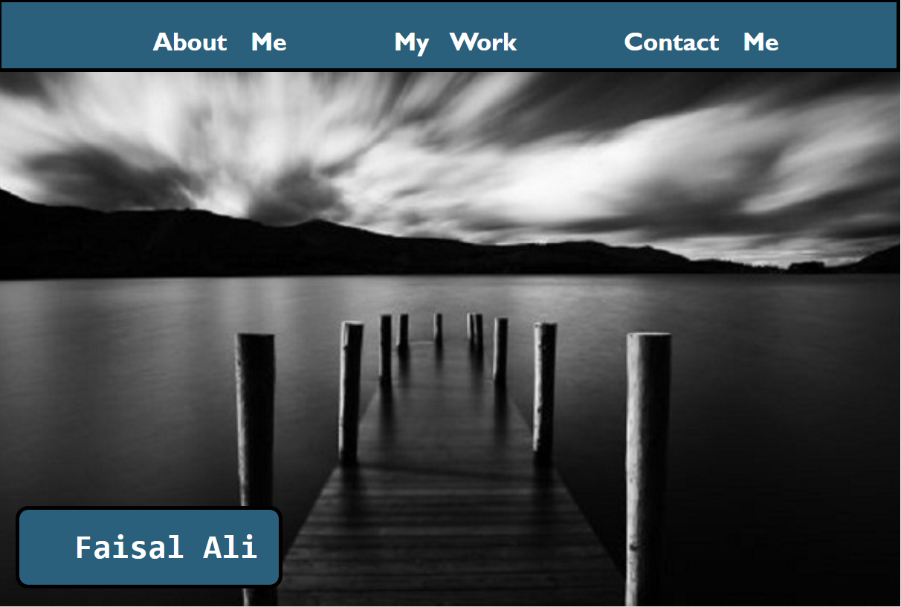

# 02 Advanced CSS: Portfolio

## Summary

Welcome to my portfolio! Here you will find my projects, information about myself and my contact information.
The page encompassses many features, such as:

* Links at the top of the website that, once clicked, take you to information about me, my projects and contact info
* A background image for my name
* The link for my first project opens in a new window, as well as my Github link

## Key Features

The following elements were included in my page:

* When the nav links at the top of the webpage are hovered over they grow and become bold or they shrink depending on the size of the window
* A nice black and white photo of the horizon behind my name
* An avatar in the about me section utilising the border-radius feature to make the image looks smoother
* The first project of my deployed work has a larger image than the rest and links to a separate window once clicked
* All images in my work section once hovered over grow larger and become more clear to make them stand out
* I have made the page responsive through the use of media queries

## Link to Deploy

[Portfolio: Faisal Ali](https://faisal-ali91.github.io/Portfolio-Advanced-CSS/) - https://faisal-ali91.github.io/Portfolio-Advanced-CSS/

## Screenshot

* Deployed: 
* Github: https://github.com/Faisal-Ali91/Portfolio-Advanced-CSS

